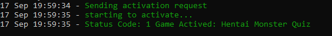

# SteamKeyActivator
Activates  steam keys




### Installation

Requires [Node.js](https://nodejs.org/).


```shh
1. open cmd => npm i
2. node key.js
```

### Settings.json


```shh
{
    "limited": "true",  // u set limited account or false - if non-limited
    "secret": ""  // ur shared secret 
}
```

### The script is based on the [library](https://github.com/DoctorMcKay/node-steamcommunity)
